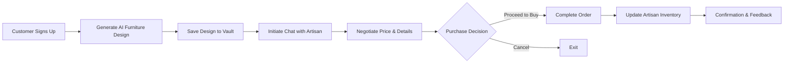

---

# 🛋️ Bespoke Studio - AI-Powered Artisan Furniture Marketplace

<div align="center">


**A high-end, full-stack marketplace enabling customers to generate custom furniture designs using AI and negotiate directly with artisans through real-time communication.**

[Features](#-features) • [Installation](#-installation) • [Usage](#-usage) • [Tech Stack](#-tech-stack) • [Project Structure](#-project-structure)

</div>

---

## 🌟 Features

### For Customers

* 🎨 **AI Design Studio** - Generate high-fidelity furniture concepts using Flux AI models
* 🏺 **Showroom Access** - Browse a premium collection of handcrafted inventory
* 💾 **Design Vault** - Save AI-generated designs to your personal gallery
* 💬 **Smart Negotiation** - Chat with artisans with contextual references
* 🔗 **Shareable Links** - Share designs or products easily

### For Artisans (Owners)

* 📢 **Inventory Management** - Add new furniture items with images, descriptions, and pricing
* 👥 **Command Center** - Monitor live customer negotiations
* ✅ **Availability Toggle** - Mark stock as “In Stock” or “Sold Out” in real-time
* 💬 **Contextual Chat** - See which product a customer is discussing
* 📈 **Studio Analytics** - Track inventory and live negotiations

### Platform Features

* 🔐 **Secure Role-Based Access** - Separate dashboards for artisans and customers
* ⚡ **Real-time Messaging** - Instant chat powered by WebSockets
* 🎨 **Glassmorphism UI** - Smooth CSS animations and premium look
* 📱 **Responsive Design** - Optimized for desktop and mobile browsing

---

## 🚀 Quick Start

### Prerequisites

* Python 3.8+
* pip (Python package manager)
* Virtual environment (recommended)

### Installation

1. **Clone the repository**

```bash
git clone https://github.com/salamlakhan7/bespoke-studio.git
cd bespoke-studio
```

2. **Create and activate virtual environment**

```bash
# Windows
python -m venv venv
venv\Scripts\activate

# macOS/Linux
python3 -m venv venv
source venv/bin/activate
```

3. **Install dependencies**

```bash
pip install -r requirements.txt
```

4. **Run database migrations**

```bash
python manage.py makemigrations
python manage.py migrate
```

5. **Create a superuser (admin)**

```bash
python manage.py createsuperuser
```

6. **Run the development server**

```bash
python manage.py runserver
```

7. **Access the application**

* Main site: `http://127.0.0.1:8000`
* Admin panel: `http://127.0.0.1:8000/admin`

---

## 📖 Usage Guide

### For Customers

1. **Sign Up** - Create a customer account
2. **Generate Designs** - Enter prompts to generate multiple AI furniture concepts
3. **Save to Vault** - Save favorite designs in the gallery
4. **Negotiate** - Chat with artisans directly about products or designs

### For Artisans

1. **Register** - Create an artisan account
2. **Manage Inventory** - Upload and update furniture items
3. **Live Chat** - Track and respond to customer negotiations
4. **Finalize Deals** - Confirm products with contextual chat references

---

## 🛠️ Tech Stack

### Backend

* **Django 5.2.8** - Python web framework
* **SQLite** - Development database
* **Redis (Optional)** - For real-time channel layers and caching
* **Pollinations AI API** - Furniture image generation

### Frontend

* **HTML5 & CSS3** - Structure and style
* **Tailwind CSS** - Modern utility-first styling
* **JavaScript (ES6+)** - Interactive functionality

### Key Features

* **WebSocket Communication** - Real-time chat
* **Role-Based Authentication** - Separate dashboards
* **AI-Driven Design** - Generate furniture concepts dynamically
* **Responsive UI** - Mobile and desktop optimized

---

## 📁 Project Structure

```
bespoke-studio/
├── b_shop/                  # Project configuration
│   ├── settings.py
│   ├── urls.py
│   └── wsgi.py
├── studio/                  # Main app
│   ├── templates/           # HTML templates
│   ├── models.py
│   ├── views.py
│   └── forms.py
├── contracts/               # Artisan dashboard
├── media/                   # Uploaded designs/images
├── manage.py
├── requirements.txt
└── README.md
```

---

## 🎨 Workflow Diagram

### Customer → AI Design → Artisan Chat → Purchase



> If the diagram doesn’t render, view on GitHub desktop or browser.

---

## 🤝 Contributing

1. Fork the repo
2. Create a feature branch: `git checkout -b feature/NewFeature`
3. Commit: `git commit -m 'Add NewFeature'`
4. Push: `git push origin feature/NewFeature`
5. Open a Pull Request

---

## 📝 License

MIT License – see [LICENSE](LICENSE)

---

## 👥 Authors

* **Abdul Salam** – Initial work – [salamlakhan7](https://github.com/salamlakhan7)

---

## 🙏 Acknowledgments

* COMSATS University Islamabad (Vehari Campus)
* Pollinations AI team
* Tailwind CSS community

---

<div align="center">

**Made with ❤️ using Django & AI**

⭐ Star this repo if you find it helpful!

</div>

---

